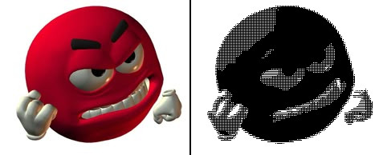

# pictureToGDSII

A small python tool to create GDSII stream format (GDSII) files from images (jpg, png, bmp, ...).

## Demo


```shell
python pictureToGDSII.py <./path/to/image.png> --dithering Halftone2x2 --masked 1 --pixel-cleanup balanced
```

## Requirements / Setup
- Only Python is required with the packages listed in `requirements.txt`.
  - "argcomplete" is an optional requirement, to enable tab completion in the command line

I suggest creating a Python Virtual Environment (venv):
```shell
# create venv
python -m venv venv
# activate the venv
source venv/bin/activate
# install the required packages
pip install -r ./requirements.txt
# optional -> to enable tab completion in the command line
pip install argcomplete
```
Afterwards, every time before using the tool the venv must be activated.
```shell
source venv/bin/activate
```

## Usage

See `./pictureToGDSII.py -h` for help.

## Features
- Dynamic scaling to achieve desired width/height: `--width-max <WIDTH_MAX [um]>` and/or `--height-max <HEIGHT_MAX [um]>`
- Adjustable gds layer number: `--layer-num <LAYER_NUM>`
- Adjustable rectangle size on gds layer: `--pixel-size <PIXEL_SIZE [um]>`
- Optional masked expansion to control random pixels: `--masked <EXPANSION_ITERATIONS>`
- Automatic removal of diagonal pixels, which are often not manufacturable: `--pixel-cleanup <CLEANUP_TYPE>`
  - remove
  - add
  - balanced
  - random
- Adaptive gaussian threshold: `--adaptive-threshold <KERNEL_SIZE> <OFFSET>`
- Multiple dithering types: `--dithering <DITHER_TYPE>`
    - 1.  Floyd-Steinberg (fs)
    - 2.  Jarvis-Judice-Ninke (jjn)
    - 3.  Stucki (st)
    - 4.  Atkinson (a)
    - 5.  Burkes (b)
    - 6.  Sierra (s)
    - 7.  Sierra-Filter-Lite (sfl)
    - 8.  Sierra-Two-Row (str)
    - 9.  Halftone2x2 (h2)
    - 10. Halftone4x4 (h4)
    - 11. Bayer2x2 (b2)
    - 12. Bayer4x4 (b4)
    - 13. Bayer8x8 (b8)

## TODO
- include automatic fill insertion for a specified area
- include min/max density constraints

## Thanks to
This project takes some inspiration from [kadomoto/picture-to-gds](https://github.com/kadomoto/picture-to-gds).

## License
This project is licensed under the Apache-2.0 License - see the [LICENSE](LICENSE) file for details
